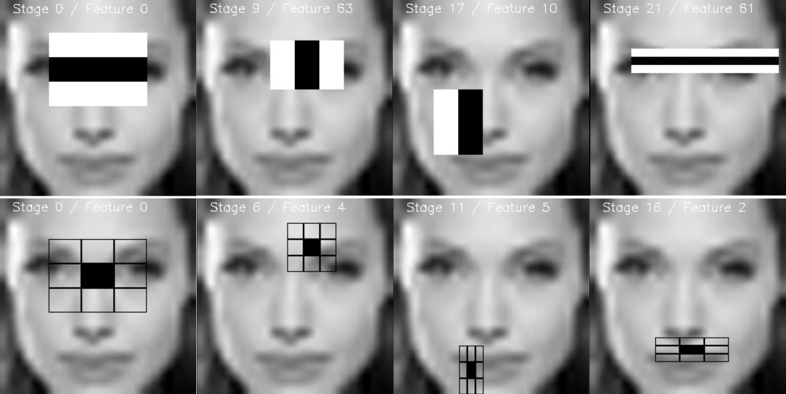
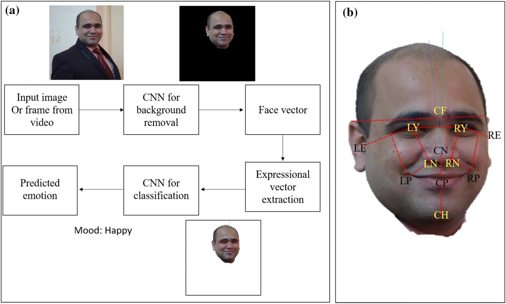

Overview & Architecture
---

**What it does:**
- Captures live video from webcam
- Detects faces and identifies emotions using AI
- Displays emotion-specific images and plays audio
- Supports customizable "emotion packs"

<!-- pause -->

**Why Rust?**

<!-- pause -->

- Because Sefa abi asked for it there was no other reason

<!-- pause -->

- And it is fun since you handle everything yourself

<!-- pause -->

**Why Multi-Threading?**
- UI stays smooth at 60 FPS
- AI processing (100-200ms) runs in background
- No freezing or blocking

<!-- end_slide -->

The Two-Stage Hybrid Approach
---

```
Stage 1: Face Detection          Stage 2: Emotion Recognition
        ↓                                  ↓
  Haar Cascade                        ONNX Model
```

<!-- pause -->

**Why Two Stages?**
- Running deep learning on entire image is slow and wasteful
- Most of the image doesn't contain faces
- **Strategy**: Quickly find faces first, then run expensive AI only on face regions

<!-- end_slide -->

Stage 1: OpenCV & Haar Cascade
---

**OpenCV** = Most popular computer vision library (Google, Microsoft, Intel)

**Haar Cascade** = Classical ML algorithm from 2001 for real-time face detection

<!-- pause -->

**How it works:**

```
┌─────┬─────┐     ┌─────────┐     ┌──┬──┬──┐
│ ■■■ │ □□□ │     │ ■■■■■■■ │     │■■│□□│■■│
│ ■■■ │ □□□ │     │ □□□□□□□ │     │■■│□□│■■│
└─────┴─────┘     └─────────┘     └──┴──┴──┘
  Eye Region        Nose Bridge      Eye-Nose-Eye
```



<!-- pause -->

**Cascade of Classifiers:**
```
Image Region
    ↓
[Check 1: Simple] → Reject 50% of non-faces (fast!)
    ↓
[Check 2: Moderate] → Reject 30% more
    ↓
[Check 3: Complex] → Final verification
    ↓
Face Detected! ✓
```

Most non-face regions fail early and are rejected immediately.

<!-- end_slide -->

Stage 2: ONNX & Deep Learning
---

**ONNX (Open Neural Network Exchange)** = Universal format for ML models

Created by Microsoft & Facebook (2017)

<!-- pause -->

**The Problem:**
```
Before ONNX:
Train in PyTorch → Deploy = Install 500+ MB framework ❌
```

**The Solution:**
```
With ONNX:
Train in PyTorch → Export to .onnx (5 MB) → Deploy anywhere ✓
```

<!-- pause -->

**Benefits:**
- 2-3x faster than PyTorch/TensorFlow
- No Python runtime needed
- Works on any platform (Windows, macOS, Linux, mobile)
- Industry standard (Microsoft Bing, Facebook, NVIDIA)

<!-- end_slide -->

HSEmotion Model & CNN Architecture
---

**Our Model:**
- **Type**: Convolutional Neural Network (CNN)
- **Input**: 260x260 RGB face image
- **Output**: 8 emotion probabilities
- **Emotions**: Angry, Disgusted, Scared, Happy, Sad, Surprised, Neutral, Contempt

<!-- pause -->

**How CNNs Recognize Emotions:**



```
Input Face (260x260)
    ↓
[Conv Layers] → Learn edges, corners, textures
    ↓
[More Conv Layers] → Learn eye shapes, mouth curves, eyebrows
    ↓
[Deep Layers] → Learn patterns:
                "Raised eyebrows + wide eyes = surprised"
                "Downturned mouth + furrowed brow = sad"
    ↓
[Final Layers] → Emotion probabilities
    ↓
Output: [Happy: 75%, Neutral: 15%, Surprised: 10%, ...]
```

<!-- pause -->

**Why Deep Learning?**
Emotions are complex and subtle—requires understanding facial muscle movements that classical algorithms can't capture.

<!-- end_slide -->

The Complete Pipeline
---

```
┌──────────────────────────────────────────────────────┐
│              CAMERA FRAME (640x480)                  │
└─────────────────────┬────────────────────────────────┘
                      │
                      ▼
┌──────────────────────────────────────────────────────┐
│          STAGE 1: FACE DETECTION (OpenCV)            │
│                                                      │
│  • Convert to grayscale                              │
│  • Run Haar Cascade at multiple scales               │
│  • Find face bounding boxes                          │
└─────────────────────┬────────────────────────────────┘
                      │
                      ▼
┌──────────────────────────────────────────────────────┐
│                    PREPROCESSING                     │
│                                                      │
│  • Extract face region                               │
│  • Resize to 260x260                                 │
│  • Normalize pixels (0-255 → 0.0-1.0)                │
└─────────────────────┬────────────────────────────────┘
                      │
                      ▼
┌──────────────────────────────────────────────────────┐
│          STAGE 2: EMOTION RECOGNITION (ONNX)         │
│                                                      │
│  • Create tensor [1, 3, 260, 260]                    │
│  • Run CNN model (HSEmotion)                         │
│  • Apply softmax → probabilities                     │
└─────────────────────┬────────────────────────────────┘
                      │
                      ▼
┌──────────────────────────────────────────────────────┐
│                    FINAL RESULT                      │
│                                                      │
│        Emotion: Happy | Confidence: 75%              │
└──────────────────────────────────────────────────────┘
```

<!-- end_slide -->

<!-- pause -->

Performance Optimizations
---

**1. Frame Skipping**
- Process every 5th frame (30 FPS → 6 FPS processing)
- Reduces CPU usage by 80%
- Still feels responsive

<!-- pause -->

**2. Confidence Threshold**
- Only show emotions with >35% confidence
- Prevents flickering between uncertain predictions
- More stable user experience

<!-- pause -->

**3. Efficient Face Detection**
- Tuned Haar Cascade parameters for speed
- Min face size: 30x30 pixels
- Scale factor: 1.1, Min neighbors: 3

<!-- pause -->

**4. Multi-Threading**
- UI thread: 60 FPS rendering
- Background thread: AI processing
- Message channels for communication

<!-- end_slide -->

<!-- jump_to_middle -->

Teşekkürler!
---